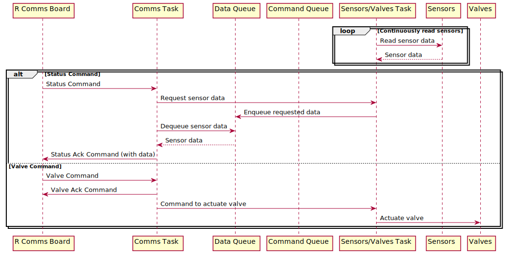

# Invictus 2.0 : Software
## Description
This repository contains all software for the boards external and internal to the rocket.
All boards use an RP2040 chip.
Each folder contains a PlatformIO project.

## Main Systems
- Mission Control (MC)
    - 1 x RComms Board
- Filling Station (FS)
    - 1 x RComms Board
    - 1 x TVCS Board
    - 1 x TCVS Shield
- Ignition "Station"
    - 1 x Ignition Board
- Rocket (R)
    - 1 x Telemetry Board
    - 1 x OBC
    - 2 x TVCS Boards
    - 1 x TVCS Shield
  
## Boards
### RComms (MC)
#### Purpose:
Estabilishing OTA communication between the MC computer and the FS

### RComms (FS/R)
#### Purpose:
Estabilishing OTA communication between the FS/R and the MC computer 
Running the Filling State Machine
Requesting sensor values to the CANha boards and forwarding them to the MC when requested
Receiving the commands from MC and sending them to the correct CANha board

#### Command Sequence Diagram

#### Radio Sequence Diagram

### TVCS (FS/R)
#### Purpose:
Reading sensor values and sending them to the telemetry board when requested
Actuating the valves / servos as requested by the telemetry board
#### Sequence Diagram:

### Ignition Board
#### Purpose:
Running the Ignition State Machine
Actuating the e-matches when the fire command is received (if the ignition state machine is in the correct state)

### OBC (On-Board Computer)
#### Purpose:
Reading the Avionics sensors, running the Kalman filter and sending the data to the Telemetry board

